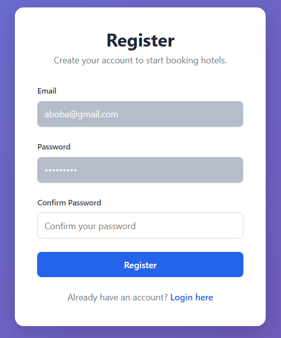
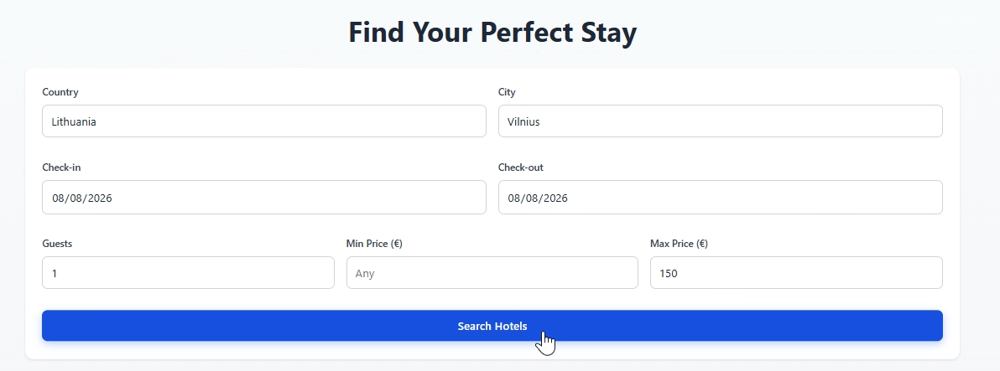
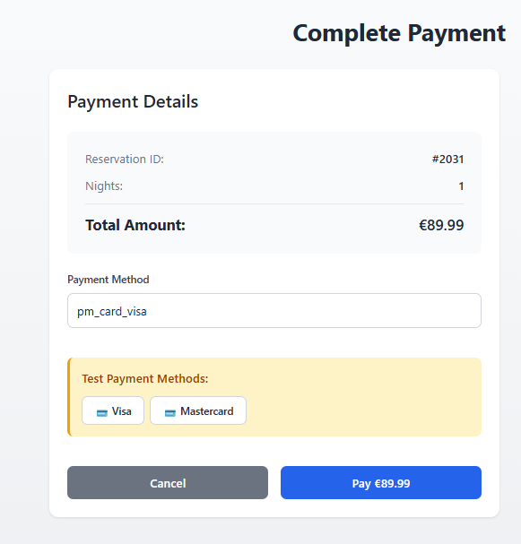
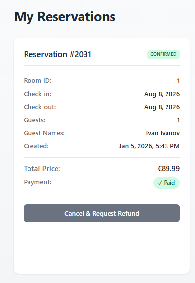
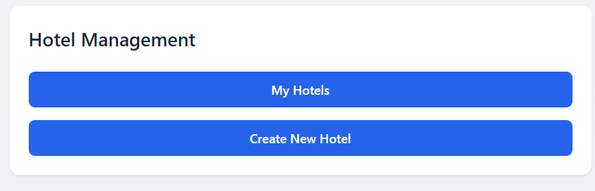
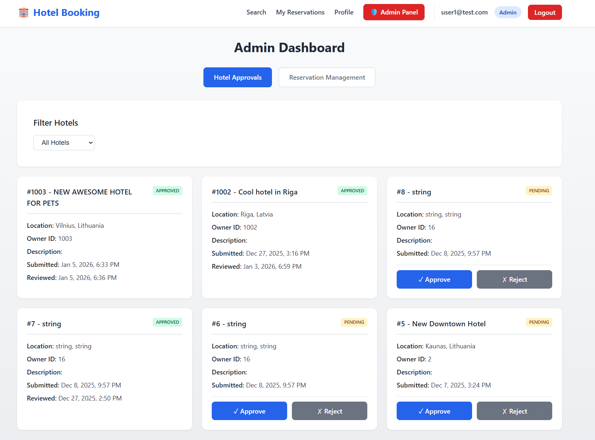

# Feature Walkthrough

## Feature 1: User Registration & Authentication

### Overview

Register for an account and authenticate to access the hotel booking platform. The system uses JWT tokens for secure, stateless authentication.

### How to Use

[Screenshot: ]

**Step 1:** Go to Users Service Swagger UI and expand `POST /api/auth/register`

**Step 2:** Click "Try it out" and enter your details:
```json
{
  "email": "alice@example.com",
  "password": "SecurePass123!",

}
```

**Step 3:** Click "Execute" - you should receive a 201 Created response

**Step 4:** Login via `POST /api/auth/login` with your credentials

**Step 5:** Copy the `accessToken` from the response and use it to authorize Swagger UI

**Expected Result:** You receive JWT access token (valid 60 minutes) and refresh token (valid 7 days)

### Tips

- Passwords must be at least 8 characters
- Email must be unique in the system

---

## Feature 2: Hotel Search

### Overview

Search for available hotels based on location, dates, guest count, and amenities. Only approved hotels with available rooms are returned.

### How to Use

[Screenshot: ]

**Step 1:** Go to Hotels Service Swagger UI

**Step 2:** Expand `GET /api/hotels/search`

**Step 3:** Enter search parameters:
- `country`: Lithuania (optional)
- `city`: Vilnius (optional)
- `checkIn`: 2026-02-01
- `checkOut`: 2026-02-05
- `guestsCount`: 2
- `petsAllowed`: false (optional)
- `minPrice`: 50 (optional)
- `maxPrice`: 200 (optional)

**Step 4:** Click "Execute"

**Expected Result:** List of matching hotels with name, location, minimum price, and available room count

### Tips

- Leave optional parameters empty for broader search
- Results only include approved hotels
- Check `cancelFreeDaysBefore` to understand cancellation policy

---


## Feature 3: Create Reservation

### Overview

Book a room for your desired dates. Reservations start with "Pending" status until payment is completed.

### How to Use

[Screenshot: ]

**Step 1:** Go to Reservations Service Swagger UI (authorized with your token)

**Step 2:** Expand `POST /api/reservations`

**Step 3:** Enter reservation details:
```json
{
  "roomId": 55,
  "startDate": "2026-02-01",
  "endDate": "2026-02-05",
  "guestsCount": 2,
  "guestsNames": "Alice Johnson, Bob Smith"
}
```

**Step 4:** Click "Execute"

**Expected Result:** Reservation created with "Pending" status and reservation ID returned

### Tips

- Room must be available for selected dates
- Guest count must not exceed room capacity
- Reservation remains Pending until payment is confirmed

---

## Feature 4: Payment Processing

### Overview

Pay for your reservation using Stripe integration. Payment confirmation changes reservation status to "Confirmed".

### How to Use

[Screenshot: ]

**Step 1:** Go to Payments Service Swagger UI (authorized with your token)

**Step 2:** Expand `POST /api/payments/create-intent`

**Step 3:** Create payment intent:
```json
{
  "reservationId": 150,
  "amount": 356.00,
  "currency": "EUR"
}
```

**Step 4:** Note the `clientSecret` from response (used for frontend payment confirmation)

**Step 5:** For testing, use Stripe test card: `4242 4242 4242 4242`

**Expected Result:** Payment intent created, Stripe processes payment via webhook, reservation becomes "Confirmed"

### Tips

- Amount should match total reservation cost (nights × price per night)
- Use Stripe test cards in test mode
- Payment status updates automatically via Stripe webhooks

---

## Feature 5: Cancellation Management

### Overview

Cancel reservations with automatic or admin-approved refunds depending on cancellation policy timing.

### How to Use

[Screenshot: ]

**Step 1:** Go to Reservations Service Swagger UI

**Step 2:** Expand `POST /api/reservations/{id}/cancel`

**Step 3:** Enter cancellation request:
```json
{
  "reason": "Change of travel plans"
}
```

**Step 4:** Click "Execute"

**Expected Result:**
- **Within free cancellation period**: Auto-canceled with automatic refund
- **Outside free period**: Request submitted for admin review

### Cancellation Policy Logic

| Timing | Result |
|--------|--------|
| More than X days before check-in | Auto-cancel + full refund |
| Less than X days before check-in | Requires admin approval |

(X = hotel's `cancelFreeDaysBefore` setting)

---

## Feature 6: Hotel Management (Hotel Owners)

[Screenshot: ]

### Overview

Hotel owners can submit hotels for approval, manage room inventory, and view reservations on their properties.

### How to Use

**Step 1:** Register or login as HotelOwner role

**Step 2:** Submit a new hotel via `POST /api/hotels`:
```json
{
  "name": "My Hotel",
  "description": "A lovely hotel in the city center",
  "country": "Latvia",
  "city": "Riga",
  "district": "Old Town",
  "addressLine": "Main Street 123",
  "petsAllowed": true,
  "cancelFreeDaysBefore": 7
}
```

**Step 3:** Wait for admin approval (status: Pending → Approved)

**Step 4:** Add rooms via `POST /api/rooms`:
```json
{
  "hotelId": 1,
  "roomNumber": "101",
  "description": "Comfortable room with city view",
  "capacity": 2,
  "bedrooms": 1,
  "pricePerNight": 89.00,
  "visible": true,
  "petsAllowed": false,
  "accommodation": "HotelRoom"
}
```

**Step 5:** View reservations on your hotel via `GET /api/hotels/{id}/reservations`:
- See all bookings on your hotel's rooms
- View guest details, dates, and status
- Track cancellation requests

**Expected Result:** Hotel submitted for approval, rooms added once hotel is approved, reservations visible to owner

---

## Feature 7: Admin Operations

[Screenshot: ]

### Overview

Administrators can approve hotels, handle cancellation requests, and manage the platform.

### How to Use

**Approve Hotels:**
1. `GET /api/admin/hotels/pending` - View pending hotels
2. `POST /api/admin/hotels/{id}/approve` - Approve a hotel
3. `POST /api/admin/hotels/{id}/reject` - Reject a hotel

**Handle Cancellations:**
1. `GET /api/admin/reservations/cancellations` - View pending requests
2. `POST /api/admin/reservations/{id}/approve-cancel` - Approve with refund
3. `POST /api/admin/reservations/{id}/reject-cancel` - Reject request

**View All Data:**
- `GET /api/users` - All users
- `GET /api/admin/hotels` - All hotels (any status)
- `GET /api/admin/reservations` - All reservations

**Expected Result:** Full platform management capabilities

---

## API Authentication Flow

| Step | Action | Result |
|------|--------|--------|
| 1 | Register | Account created |
| 2 | Login | Receive access + refresh tokens |
| 3 | Use access token | Access protected endpoints |
| 4 | Token expires (60 min) | Call refresh endpoint |
| 5 | Refresh token | Receive new access + refresh tokens |
| 6 | Logout | Refresh token revoked |


